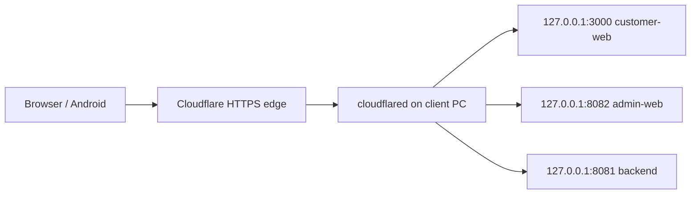
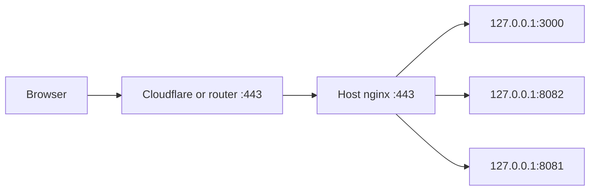
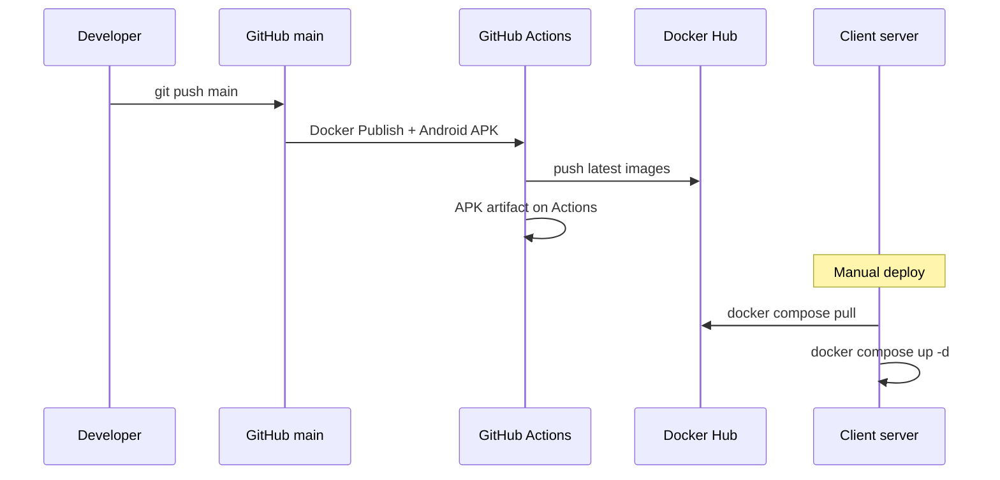

# Production deployment playbook (Citta + template for more apps)

Use this document when deploying **Citta e-commerce** or when replicating the same pattern for **another app on the same domain** (different subdomains, separate Docker stack/network).

**What this covers**

1. Nginx (optional on-host reverse proxy)
2. Cloudflare DNS + Tunnel (`cloudflared`)
3. Production `docker-compose` and `.env`
4. CI/CD (GitHub Actions → Docker Hub + Android APK)
5. Manual deploy on the client server
6. Running **multiple apps** on one domain without port/network conflicts

---

## 1. Architecture (what we run today)

### Citta e-commerce — public URLs

| Role | Subdomain | Docker host port | Container |
|------|-----------|------------------|-----------|
| Customer web store | `www.cittainfotronics.com` | **3000** | `citta-customer-web` |
| Admin UI | `admin.cittainfotronics.com` | **8082** | `citta-admin-web` |
| REST API | `secure.cittainfotronics.com` | **8081** | `citta-backend` |
| PostgreSQL | (internal only) | — | `citta-postgres` |
| Elasticsearch | (internal only) | — | `citta-elasticsearch` |

Android app talks to **`https://secure.cittainfotronics.com`** (not Docker).

### Traffic path (Cloudflare Tunnel — our setup)



- **No public IP** on the client PC is required.
- Cloudflare terminates **HTTPS**; tunnel forwards plain HTTP to localhost ports.
- Public URLs use **`https://`** with **no port numbers**.

### Traffic path (optional host nginx)

If you use **host nginx** on 80/443 instead of tunnel-to-port, nginx routes by `server_name` to the same Docker ports. See `deploy/nginx-host-routing.example.conf` and `deploy/WIN-ACME-NGINX.md`.



**Citta production uses Cloudflare Tunnel direct to Docker ports** (Option A below). Nginx is documented as an alternative.

---

## 2. Cloudflare setup

### 2.1 Add domain to Cloudflare

1. Create/login at [cloudflare.com](https://cloudflare.com).
2. **Add site** → enter `cittainfotronics.com`.
3. Cloudflare shows **nameservers** — set these at your domain registrar (replace old NS).
4. Wait until Cloudflare shows the zone as **Active**.

### 2.2 DNS records (Tunnel mode)

With **Cloudflare Tunnel**, you typically **do not** use A records to a home IP.

`cloudflared` creates **CNAME** records automatically when you configure public hostnames, e.g.:

| Type | Name | Target |
|------|------|--------|
| CNAME | `www` | `<tunnel-id>.cfargotunnel.com` |
| CNAME | `admin` | `<tunnel-id>.cfargotunnel.com` |
| CNAME | `secure` | `<tunnel-id>.cfargotunnel.com` |
| CNAME | `@` (apex) | `<tunnel-id>.cfargotunnel.com` (or redirect `www`) |

In **Zero Trust / Tunnels** UI, each **Public Hostname** adds the DNS entry for you.

### 2.3 Create the tunnel (`cloudflared`)

On the **client Windows PC** (where Docker runs):

1. Install `cloudflared`: https://developers.cloudflare.com/cloudflare-one/connections/connect-networks/downloads/
2. Login: `cloudflared tunnel login`
3. Create tunnel: `cloudflared tunnel create citta-prod`
4. Note the **tunnel ID** and credentials file path.

### 2.4 Tunnel ingress (`config.yml`)

Point each **public hostname** to the **host port** Docker publishes on `127.0.0.1` (not container names).

**File example** (e.g. `%USERPROFILE%\.cloudflared\config.yml`):

```yaml
tunnel: <TUNNEL_ID>
credentials-file: C:\Users\<USER>\.cloudflared\<TUNNEL_ID>.json

ingress:
  - hostname: www.cittainfotronics.com
    service: http://127.0.0.1:3000
  - hostname: cittainfotronics.com
    service: http://127.0.0.1:3000
  - hostname: admin.cittainfotronics.com
    service: http://127.0.0.1:8082
  - hostname: secure.cittainfotronics.com
    service: http://127.0.0.1:8081
  - service: http_status:404
```

Run as a service:

```powershell
cloudflared service install
cloudflared service start
```

Or configure hostnames in **Cloudflare Zero Trust → Networks → Tunnels → Public Hostname** (same mapping: hostname → `http://localhost:PORT`).

### 2.5 Cloudflare dashboard settings (recommended)

| Setting | Where | Recommendation |
|---------|--------|----------------|
| **SSL/TLS mode** | SSL/TLS → Overview | **Full** (tunnel origin is HTTP on localhost; edge is HTTPS) |
| **Always Use HTTPS** | SSL/TLS → Edge Certificates | On |
| **Caching** | Caching | After admin deploy changes, **Purge Everything** once (admin API URL is in `index.html`) |
| **WebSockets** | Network | On (if needed later) |
| **Minimum TLS** | SSL/TLS | 1.2+ |

### 2.6 Verify tunnel

| Test | Expected |
|------|----------|
| `https://secure.cittainfotronics.com/api/hello` | JSON hello |
| `https://admin.cittainfotronics.com` | Admin login |
| `https://www.cittainfotronics.com` | Customer store |
| Admin login API in DevTools | URL starts with `https://secure...` |

More troubleshooting: `deploy/CLOUDFLARE-TUNNEL.md`.

---

## 3. Nginx (optional — not required for tunnel-direct setup)

Use host nginx when you have a **public IP**, router forwards **80/443**, and you want one entry point on the server.

**Reference file:** `deploy/nginx-host-routing.example.conf`

| `server_name` | `proxy_pass` |
|---------------|--------------|
| `www.cittainfotronics.com` | `http://127.0.0.1:3000` |
| `admin.cittainfotronics.com` | `http://127.0.0.1:8082` |
| `secure.cittainfotronics.com` | `http://127.0.0.1:8081` |

With nginx + TLS, set `.env` URLs to `https://` **without ports**.

**Windows TLS:** `deploy/WIN-ACME-NGINX.md`.

**Tunnel + nginx together:** point tunnel ingress to `http://127.0.0.1:80` and let nginx route by subdomain (Option B in `CLOUDFLARE-TUNNEL.md`).

---

## 4. Client server layout

Recommended folder on the Windows client PC:

```text
D:\e-commerce\Compose_and_env_files\Compose and env files\
  docker-compose.prod.example.yml   # or copy as docker-compose.yml
  .env                              # secrets + production URLs (never commit)
```

Rules:

- `.env` lives in the **same folder** as the compose file you run.
- Never commit `.env` to git.
- Copy from repo template: `.env.prod.example` → `.env` on server.

---

## 5. Production compose file

**Repo file:** `docker-compose.prod.example.yml`

### What it defines

| Service | Image | Host port | Notes |
|---------|-------|-----------|--------|
| `postgres` | `postgres:16-alpine` | none | Volume `postgres_data` |
| `elasticsearch` | `elasticsearch:9.2.6` | none | Volume `elasticsearch_data` |
| `backend` | `deepakdhanwani/citta-backend:latest` | **8081→8080** | Healthcheck, Liquibase on start |
| `admin-web` | `deepakdhanwani/citta-admin-web:latest` | **8082→80** | `API_BASE_URL` from `.env` |
| `customer-web` | `deepakdhanwani/citta-customer-web:latest` | **3000→80** | Static Expo web build |

### Important compose details

- **`pull_policy: always`** on app images — always check Docker Hub on deploy.
- **`depends_on` + `service_healthy`** — postgres/ES → backend → frontends.
- **`CORS_ALLOWED_ORIGINS`** is set from **`CITTA_CORS_ALLOWED_ORIGINS`** in `.env` (avoids Windows shell override of `CORS_ALLOWED_ORIGINS`).
- **Infra images** (postgres, ES) are pinned versions — do not auto-update via Watchtower.

### Deploy commands (manual)

```powershell
cd "D:\e-commerce\Compose_and_env_files\Compose and env files"

docker compose -f docker-compose.prod.example.yml pull backend admin-web customer-web

docker compose -f docker-compose.prod.example.yml up -d backend admin-web customer-web

docker exec citta-backend wget -qO- http://127.0.0.1:8080/api/hello
```

---

## 6. Production `.env` file

**Template:** `.env.prod.example`

### Required variables (Citta)

```env
IMAGE_TAG=latest

POSTGRES_USER=postgres
POSTGRES_PASSWORD=<strong-password>

JWT_SECRET=<long-random-secret>
SUPER_ADMIN_PASSWORD=<bootstrap-password>
ADMIN_BOOTSTRAP_PASSWORD=<bootstrap-password>

# Public HTTPS URLs — NO ports when using Cloudflare Tunnel
API_PUBLIC_URL=https://secure.cittainfotronics.com
API_BASE_URL=https://secure.cittainfotronics.com
EXPO_PUBLIC_API_BASE_URL=https://secure.cittainfotronics.com
VITE_API_BASE_URL=https://secure.cittainfotronics.com

# Use CITTA_ prefix (not CORS_ALLOWED_ORIGINS on Windows)
CITTA_CORS_ALLOWED_ORIGINS=https://www.cittainfotronics.com,https://cittainfotronics.com,https://admin.cittainfotronics.com,https://secure.cittainfotronics.com

SUPER_ADMIN_EMAIL=superadmin@citta.com
ADMIN_BOOTSTRAP_EMAIL=admin@citta.com

ELASTICSEARCH_ENABLED=true
SPRING_PROFILES_ACTIVE=elasticsearch
```

### Variable purposes

| Variable | Used by | Purpose |
|----------|---------|---------|
| `API_BASE_URL` | admin container at **runtime** | Injected into `index.html` as API URL |
| `VITE_API_BASE_URL` | admin image at **build time** (CI) | Fallback in JS bundle |
| `EXPO_PUBLIC_API_BASE_URL` | customer-web + Android at **build time** | API in static/mobile bundle |
| `CITTA_CORS_ALLOWED_ORIGINS` | backend at **runtime** | Browser CORS (admin + shop origins) |
| `POSTGRES_PASSWORD` / `JWT_SECRET` | backend, postgres | Auth and DB |

### Windows `.env` pitfalls

- **`#` starts a comment** — do not use `#` in passwords unless quoted.
- **`$` must be `$$`** in Compose `.env` if you must use it.
- **Shell env `CORS_ALLOWED_ORIGINS`** on Windows can override compose — use `CITTA_CORS_ALLOWED_ORIGINS` in prod.

### Verify after changes

```powershell
docker compose -f docker-compose.prod.example.yml up -d --force-recreate backend admin-web
docker exec citta-backend printenv CORS_ALLOWED_ORIGINS
docker exec citta-admin-web printenv API_BASE_URL
```

---

## 7. CI/CD (GitHub Actions)

### 7.1 Docker images — on every push to `main`

**Workflow:** `.github/workflows/docker-publish.yml`

| Step | Runner | Action |
|------|--------|--------|
| Compile backend | GitHub cloud | `mvn package -DskipTests` |
| Build & push ×3 | GitHub cloud | Docker Hub |

**Images pushed:**

- `deepakdhanwani/citta-backend:latest` + `main-<sha>`
- `deepakdhanwani/citta-admin-web:latest` + `main-<sha>`
- `deepakdhanwani/citta-customer-web:latest` + `main-<sha>`

**GitHub secrets required:**

| Secret | Purpose |
|--------|---------|
| `DOCKERHUB_USERNAME` | Docker Hub login |
| `DOCKERHUB_TOKEN` | Docker Hub access token |
| `VITE_API_BASE_URL` | Optional; default `https://secure.cittainfotronics.com` |
| `EXPO_PUBLIC_API_BASE_URL` | Optional; same |

**Client deploy:** manual `compose pull` + `up -d` after CI is green (auto-deploy via self-hosted runner can be added later).

### 7.2 Android APK — on every push to `main`

**Workflow:** `.github/workflows/android-apk.yml`

| Step | Action |
|------|--------|
| EAS cloud build | `preview` profile → **APK** |
| Upload | GitHub Actions **Artifacts** (90 days) |

**GitHub secret required:** `EXPO_TOKEN` (from expo.dev)

**Download:** Actions → **Android APK** run → **Artifacts** → `citta-shop-apk-<sha>`.

Optional email: see `deploy/BUILD-ANDROID.md`.

---

## 8. End-to-end release process (today)



**Developer:** push to `main`.

**Automatic:** images on Docker Hub; APK in Artifacts.

**You on client server (after CI green):**

```powershell
cd "D:\e-commerce\Compose_and_env_files\Compose and env files"
docker compose -f docker-compose.prod.example.yml pull backend admin-web customer-web
docker compose -f docker-compose.prod.example.yml up -d backend admin-web customer-web
```

**Optional:** Purge Cloudflare cache after admin-web changes.

---

## 9. Hosting a second app on the same domain

Use this section when adding **another Cursor-built app** on `cittainfotronics.com` with **different subdomains** and an **isolated Docker stack**.

### 9.1 Principles

| Rule | Why |
|------|-----|
| **Separate compose project** per app | Independent lifecycle, `.env`, volumes |
| **Separate Docker network** per app | Containers from app A cannot see app B’s DB |
| **Unique host ports** per app | No conflict on `127.0.0.1` |
| **Unique subdomains** | Tunnel/nginx routes by hostname |
| **Unique image names** on Docker Hub | e.g. `deepakdhanwani/otherapp-backend` |
| **Separate `.env`** per app folder | Secrets and URLs must not mix |

### 9.2 Port allocation example

| App | Customer | Admin | API |
|-----|----------|-------|-----|
| **Citta** (existing) | 3000 | 8082 | 8081 |
| **App 2** (new) | 3010 | 8092 | 8091 |
| **App 3** (new) | 3020 | 8102 | 8101 |

Pick a block of ports per app and document them.

### 9.3 Second app — subdomain example

| Role | Subdomain |
|------|-----------|
| Web | `shop2.cittainfotronics.com` |
| Admin | `admin-shop2.cittainfotronics.com` |
| API | `api-shop2.cittainfotronics.com` |

### 9.4 Add tunnel ingress (same `cloudflared`)

Append to `config.yml` **before** the final `http_status:404` rule:

```yaml
  - hostname: shop2.cittainfotronics.com
    service: http://127.0.0.1:3010
  - hostname: admin-shop2.cittainfotronics.com
    service: http://127.0.0.1:8092
  - hostname: api-shop2.cittainfotronics.com
    service: http://127.0.0.1:8091
```

In Cloudflare Zero Trust → Tunnels → **Public Hostname**, add the same three rows.

Restart tunnel / `cloudflared service restart`.

### 9.5 Second app — compose skeleton

**Folder:** `D:\apps\shop2\` (separate from Citta)

```yaml
name: shop2-prod

services:
  postgres:
    image: postgres:16-alpine
    container_name: shop2-postgres
    networks: [shop2_net]
    # ... volumes, env from .env

  backend:
    image: deepakdhanwani/shop2-backend:latest
    container_name: shop2-backend
    networks: [shop2_net]
    ports:
      - "8091:8080"
    env_file: [.env]
    depends_on:
      postgres:
        condition: service_healthy

  admin-web:
    image: deepakdhanwani/shop2-admin-web:latest
    container_name: shop2-admin-web
    networks: [shop2_net]
    ports:
      - "8092:80"
    environment:
      API_BASE_URL: ${API_BASE_URL}

  customer-web:
    image: deepakdhanwani/shop2-customer-web:latest
    container_name: shop2-customer-web
    networks: [shop2_net]
    ports:
      - "3010:80"

networks:
  shop2_net:
    name: shop2_net
```

Citta keeps its default compose network; **do not** attach both stacks to the same network unless you intentionally share services.

### 9.6 Second app — `.env` template

```env
IMAGE_TAG=latest
API_BASE_URL=https://api-shop2.cittainfotronics.com
VITE_API_BASE_URL=https://api-shop2.cittainfotronics.com
EXPO_PUBLIC_API_BASE_URL=https://api-shop2.cittainfotronics.com
APP_CORS_ALLOWED_ORIGINS=https://shop2.cittainfotronics.com,https://admin-shop2.cittainfotronics.com,https://api-shop2.cittainfotronics.com
# ... DB passwords, JWT, etc.
```

Map `APP_CORS_ALLOWED_ORIGINS` → `CORS_ALLOWED_ORIGINS` in that app’s compose (same Windows pattern as `CITTA_CORS_ALLOWED_ORIGINS`).

### 9.7 Second app — CI/CD (copy pattern)

In the **new repo**, add:

- `.github/workflows/docker-publish.yml` — change image names and build contexts
- GitHub secrets: same Docker Hub / API URL secrets (or app-specific)
- Optional: `android-apk.yml` if the app has mobile

Point Cursor at this playbook: *“Follow `PRODUCTION-PLAYBOOK.md` sections 9 and 7 for a second stack on ports 3010/8091/8092.”*

### 9.8 Checklist — new app on same domain

- [ ] Pick unused host ports (e.g. 3010, 8091, 8092)
- [ ] Pick subdomains and add **tunnel public hostnames**
- [ ] Create separate server folder + `.env` + compose `name:` + `networks:`
- [ ] Set all public URLs to `https://` (no ports)
- [ ] Configure CORS for all HTTPS origins
- [ ] Create Docker Hub repos for new images
- [ ] Add GitHub Actions workflows in new repo
- [ ] Build/push images; on server: `compose pull` + `up -d`
- [ ] Verify: API hello, admin login, shop load over HTTPS
- [ ] Purge Cloudflare cache after first admin deploy

---

## 10. Repo file index

| File | Purpose |
|------|---------|
| `docker-compose.prod.example.yml` | Client production stack (pull from Hub) |
| `docker-compose.build.example.yml` | Local/CI build from source |
| `.env.prod.example` | Server `.env` template |
| `deploy/CLOUDFLARE-TUNNEL.md` | Tunnel troubleshooting |
| `deploy/nginx-host-routing.example.conf` | Optional host nginx |
| `deploy/WIN-ACME-NGINX.md` | Windows TLS for nginx |
| `deploy/BUILD-PRODUCTION.md` | Build + manual deploy |
| `deploy/BUILD-ANDROID.md` | Mobile APK / EAS / CI |
| `.github/workflows/docker-publish.yml` | CI → Docker Hub |
| `.github/workflows/android-apk.yml` | CI → APK artifact |

---

## 11. Common issues (quick reference)

| Symptom | Likely cause | Fix |
|---------|--------------|-----|
| Admin login calls `http://` API | Cached config or `.env` still `http://` | `API_BASE_URL=https://...`, recreate admin-web, purge CF cache |
| CORS error on login | Backend CORS missing admin origin | Fix `CITTA_CORS_ALLOWED_ORIGINS`, recreate backend |
| `printenv` CORS shows `localhost` | Windows shell env or wrong `.env` key | Use `CITTA_CORS_ALLOWED_ORIGINS`; clear shell var |
| Tunnel 502 / timeout | Wrong ingress port or container down | Check `docker ps`, fix `config.yml` port |
| Compose `.env` password wrong | `#` or `$` in password | Quote password or avoid those characters |
| CI deploy job waits forever | Runner label mismatch | Match `runs-on` labels to runner |
| Android CI fails immediately | Missing `EXPO_TOKEN` or invalid workflow `if` | Add secret; use `vars` not `secrets` in `if` |

---

## 12. Cursor prompt for a new app

Paste into the new project’s Cursor chat:

```text
We deploy like Citta (see PRODUCTION-PLAYBOOK.md). Same domain cittainfotronics.com,
new subdomains: shop2 / admin-shop2 / api-shop2. New Docker network shop2_net.
Host ports: 3010 (web), 8092 (admin), 8091 (api). Cloudflare Tunnel ingress only.
Create docker-compose.prod.example.yml, .env.prod.example, GitHub Actions docker-publish.yml,
and document CORS + HTTPS API URLs. Do not share network or ports with Citta (3000/8081/8082).
```

---

*Last updated for Citta e-commerce: Cloudflare Tunnel + Docker Hub CI + manual client deploy + Android APK on push to `main`.*
